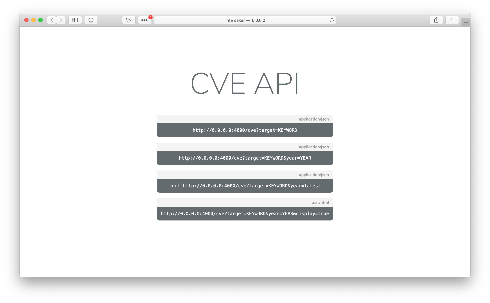

Parse & filter the latest CVEs from <https://cve.mitre.org>

## Docs

### Usage

`http://localhost:4000/cve?target=KEYWORD`

The year parameter is optional.\
`http://localhost:4000/cve?target=KEYWORD&year=YEAR`

#### Examples

`http://localhost:4000/cve?target=ruby%20on%20rails`\

`http://localhost:4000/cve?target=ruby%20on%20rails&year=2020`

If you want to parse the latest year, use the "latest" keyword.\
`http://localhost:4000/cve?target=ruby%20on%20rails&year=latest`

## Getting started

- Download the project
- `bundle install`
- `ruby rest.rb`

## Requirements

- [Ruby](https://www.ruby-lang.org/en/)
- [Docker](https://www.docker.com) (Optional, only required if you want to run through a container.)

### Environment

You can switch between prod & dev at `config/environment.rb`\
You need to create one yourself, an example can be found [here](config/environment-example.rb).

### Healthcheck

The url will return a status code of 200 which means the api is healthy.\
If 200 is not shown then you should assume there is something wrong.\
`http://localhost:4000/status`

## Manage image

### Access

You can access the api via <http://localhost:4000/> \
You should be able to view the index page from the url.

### Build image

`docker build . -t cve-api`

### Run image

`docker run -p 4000:4000 -d cve-api`

### Get id

`docker ps`

### Stop image

`docker stop ID`

#### Remove image

`docker rmi cve-api`
