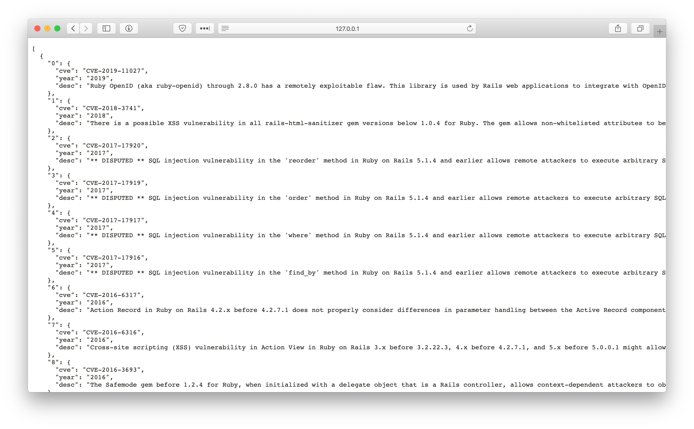
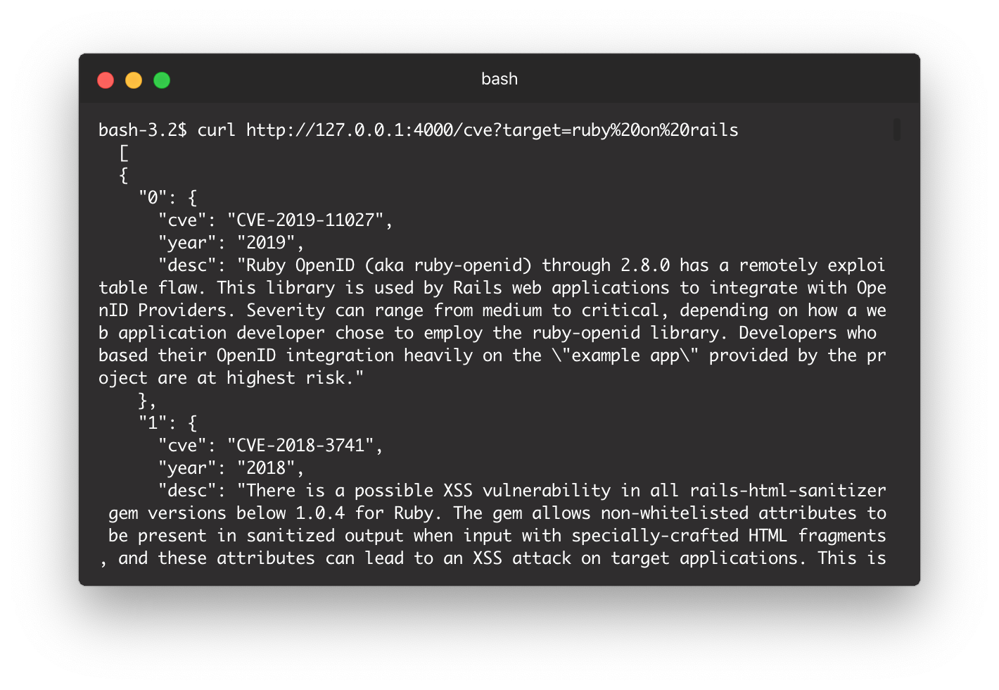

# CVE Api

Parse & filter CVEs from <https://cve.mitre.org>.

## Docs

### Usage

`http://localhost:4000/cve?target=KEYWORD`

The year parameter is optional.\
`http://localhost:4000/cve?target=KEYWORD&year=YEAR`

#### Examples

`http://localhost:4000/cve?target=ruby%20on%20rails`\

`http://localhost:4000/cve?target=ruby%20on%20rails&year=2020`

If you want to parse the latest year, use the "latest" keyword.\
`http://localhost:4000/cve?target=ruby%20on%20rails&year=latest`

The api also supports the terminal!\
`http://localhost:4000/raw?target=ruby%20on%20rails`\

## Getting started

- Download the project
- `bundle install`
- `ruby rest.rb`

## Requirements

- [Ruby](https://www.ruby-lang.org/en/)

Optional, only required if you want to run through a container

- [Docker](https://www.docker.com)

### Environment

You can switch between prod & dev at `config/environment.rb`\
You need to create one yourself, an example can be found [here](config/environment-example.rb).

## Manage image

### Build image

`docker build . -t cve-api`

### Run image

`docker run -p 4000:4000 -d cve-api`

#### Access

You can access the api via <http://local-ip:4000/>

### Get status & id

`docker ps`

### Stop image

`docker stop ID`

#### Remove image

`docker rmi cve-api`

### Uptime robot

The url will return a status code of 200 which means the api is healthy.\
If 200 is not shown then you should assume there is something wrong.\
`http://localhost:4000/status`
